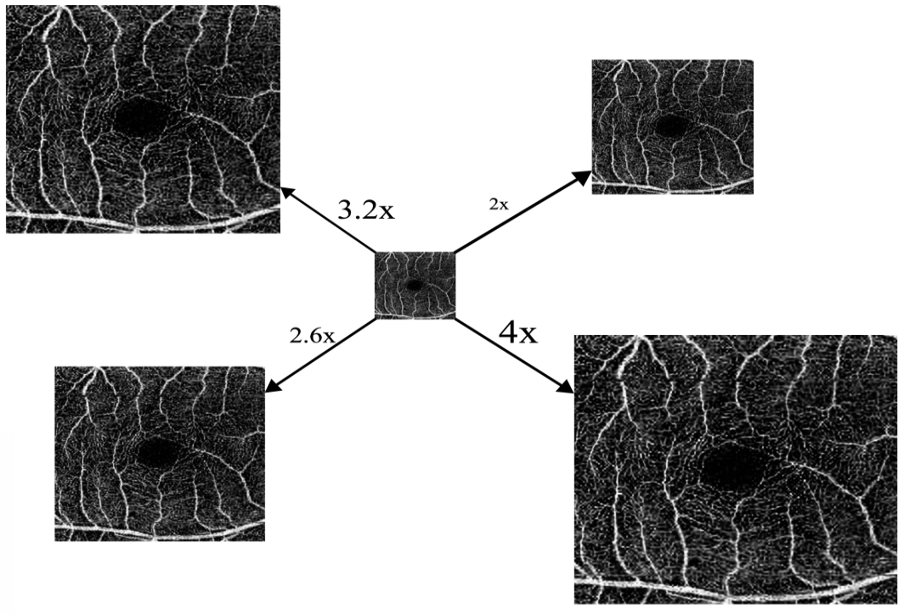

# OW-SLR: Overlapping Windows on Semi-Local Region for Image Super-Resolution
### [Project Page](https://rishavbb.github.io/ow-slr/index.html) | [Paper](https://www.mdpi.com/2313-433X/9/11/246) | [Data](https://ieee-dataport.org/open-access/octa-500)

This is the official implementation for [OW-SLR: Overlapping Windows on Semi-Local Region for Image Super-Resolution](https://www.mdpi.com/2313-433X/9/11/246). OW-SLR provides better results for classifying healthy and diseased retinal images such as diabetic retinopathy and normals from the given set of OCT-A images.



### Training
Images to be trained are put in the "data" folder and validation images in the "val" folder.

```
python3 train.py --config train.yaml
```

### Testing

```
python3 test.py --config train.yaml --batch_size 40000 --img_path 438.png --upscale_factor 4.5 --model_path save/train/epoch-last.pth
```
Please change the arguments mentioned above as per requirement. We have given an example for quick replication.
Considering reducing the batch size if you run out of GPU memory.


## Citation

If you find this code useful for your research, please use the following BibTeX entry.

```
@article{bhardwaj2023ow,
  title={OW-SLR: overlapping windows on semi-local region for image super-resolution},
  author={Bhardwaj, Rishav and Balaji, Janarthanam Jothi and Lakshminarayanan, Vasudevan},
  journal={Journal of Imaging},
  volume={9},
  number={11},
  pages={246},
  year={2023},
  publisher={MDPI}
}


```

## Acknowledgments

Our project is benefit from these great resources:

- [Learning Continuous Image Representation with Local Implicit Image Function](https://github.com/yinboc/liif/tree/main)

Thanks for their sharing code.
